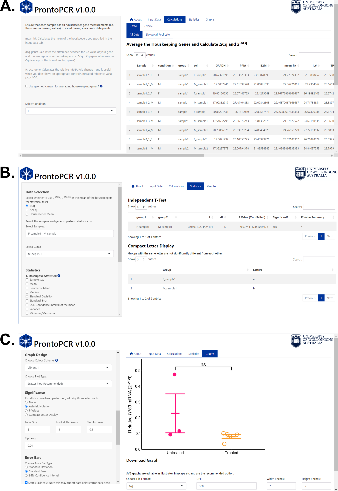

# Summary

Quantitative Polymerase Chain Reaction (qPCR) is an essential technique used to amplify and quantify the amount of DNA, gene or transcript in a sample by measuring the quantification cycle (Cq) threshold. qPCR is widely used in molecular biology, genetics, and diagnostics, and involves a standardised and routine analysis process. Inherently, this means qPCR analysis is repetitive and time-consuming, especially for large data sets. Therefore, an intuitive and versatile software application would be beneficial to automate and fast-track the analysis for a variety of disciplines. \texttt{ProntoPCR} is a software application that serves this purpose, aiming to efficiently and automatically perform routine qPCR calculations, such as averaging the housekeeper genes, calculating ΔCq, ΔΔCq, relative fold-change ($2^{−ΔCq}$), and fold-change ($2^{−ΔΔCq}$) of the target gene. It also provides the user with options to perform statistics and graphing of the data. 

# Statement of Need

Methods of quantifying relative gene expression through qPCR have remained largely unchanged since its implementation in 2001 [@livak2001analysis]. These calculations rely on raw quantification cycle (Cq) results from a qPCR reaction, which can then be normalised in various manners (Table 1). These methods however, are usually performed manually in programs such as Excel. Although this quantification is relatively simple, there are caveats to manual analysis such as being time consuming and prone to human or data entry errors. There is a growing need to automate these tasks, especially for handling large volumes of data. Presenting data in graphical formats is also a laborious task for many samples and targets. Therefore, we developed an application called \texttt{ProntoPCR} to address these issues by seamlessly semi-automating the calculations and analysis of qPCR data. A user can go from raw data to results, including statistics and graphs in just a few clicks.

: Description of terms and formulas used in qPCR calculations within ProntoPCR.

|  **Term**            | **ProntoPCR Alias**  | **Formula/Explanation** |
| :------------------- | :------------- | :---------------------- |
| Housekeeper Average | mean_hk             | = Mean(Housekeeper Gene *1*, ..., Housekeeper Gene *n*)  |
| ΔCq (Delta Cq)      | dcq_gene            | = Cq (Gene of Interest) - Cq (Housekeeper Average) |
| $2^{−ΔCq}$ (Relative Fold Change) |  fc_dcq_gene | = $2^{−ΔCq}$ |
| ΔCq Control Average    | dcq_ctrl_avg | The average ΔCq value for the control group for the selected gene. Used for ΔΔCq calculations   |
| ΔΔCq (Delta Delta Cq) | ddcq_gene | = ΔCq (Gene of Interest) - ΔCq (Control Average) |
| $2^{−ΔΔCq}$ (Fold Change) | fc_ddcq_gene | = $2^{−ΔΔCq}$ |

# State of the Field

Several tools have been developed to support qPCR analysis across different research contexts and levels of technical expertise. Numerous established R packages support ΔCq and ΔΔCq workflows within a coding environment, including the CRAN/Bioconductor packages *tidyqpcr*, *qPCRtools*, *pcr* and *HTqPCR* [@Wallace_2022; @Li_2022; @Ahmed_2018; @Dvinge_2009]. The *qpcR* package also focuses on amplification curve modelling and efficiency estimation [@Ritz_2008]. While these packages provide flexibility and PCR analysis support, they are primarily designed for scripted workflows and thus require familiarity with R programming. 

Graphical applications with point-and-click interfaces have also been developed. For example, *shinyCurves* provides an interface for amplification curve visualisation and Cq extraction within viral detection contexts [@Olaechea_L_zaro_2021]. The *SATqPCR* web application further extends this landscape by implementing MIQE-guided analysis, incorporating efficiency correction and geNorm-based reference gene selection within a browser-based interface [@Rancurel_2019]. *FaDA* is a broader laboratory data analysis platform that supports qPCR, amongst other assay types [@Danger_2021]. General online relative gene expression calculators also exist. Although these applications improve accessibility, they focus on specific tasks rather than offering a single, integrated workflow for routine relative gene expression. *Qupid* is a Python-based application built using Streamlit that provides a local browser-rendered interface for ΔΔCt analysis. It supports flexible data structures through the use of metadata “decorators,” which are text markers inserted within input files to designate assays, normalisers, and replicate groups [@kleinschmidt2023qupid]. In contrast, ProntoPCR is structured around commonly exported instrument formats and guided user selections, reducing the need for manual file modification while integrating normalisation, statistical testing, and graphical output within a single workflow.

# Overview

\texttt{ProntoPCR} is an open-source, R shiny [@shiny] software application available both online and locally as an R package [@R], making it accessible to users with minimal programming experience. It is also designed to be compatible with the output generated by PCR machines, such as the Quantstudio 5 (Thermo Fisher Scientific) enabling the user to get instant results. Users only require a comma separated values (CSV) file of the raw data, including the quantification cycle (Cq) values, the target (gene) and sample name to get started. The app layout is split into multiple tabs including the About, Input Data, Calculations (Fig. 1A), Statistics (Fig. 1B), and Graphs (Fig. 1C) tabs.

# Accessing and Using ProntoPCR

\texttt{ProntoPCR} has been designed to operate both online and locally. Whilst we aim to maintain online availability, the hosted platform may change or become unavailable. Therefore, it is recommended to rely on the local version, which functions with the same features as the online option. The local version also does not require internet access once installed. To run the application locally, the user needs to download [R](https://cran.r-project.org/) and [RStudio](https://posit.co/downloads/). A step-by-step guide on how to install and use \texttt{ProntoPCR} is available: [ProntoPCR Handbook](https://marniemaddock.github.io/ProntoPCR/). The guide is aimed at users with minimal programming expertise, making ProntoPCR accessible to all researchers. An example dataset can be downloaded directly from the application. The online application is available [here](https://marniem.shinyapps.io/ProntoPCR/).

# Requirements and Limitations

The main requirement for \texttt{ProntoPCR} to run is a correctly formatted .csv file, including the sample names. If the inserted .csv file does not meet the requirements, a variety of error messages can prompt the user to alter the .csv file until it is in the correct format (see [user guide](https://marniemaddock.github.io/ProntoPCR/)). The application also does not include exhaustive options for statistics and graphing; however, users can download the results of each calculation, which can be fed into their own analysis pipelines. 

# Assumptions

ProntoPCR implements the Livak and Schmittgen $2^{−ΔΔCq}$ method for relative quantification by default [@livak2001analysis]. This approach assumes that amplification efficiencies are between 90 - 110% and approximately equal between the target and reference (housekeeper) genes. If amplification efficiencies differ substantially, efficiency-corrected models such as the Pfaffl method [@pfaffl2001relative] should alternatively be used. Users are therefore encouraged to experimentally validate primer efficiencies prior to using the ProntoPCR workflow.

# Acknowledgements

This project was supported by the University of Wollongong and the Australian Government Research Training Program (AGRTP) scholarship, Friedreich’s Ataxia Research Alliance, Friedreich Ataxia Research Association Australia, Australian Research Council Linkage Grant (LP190101139), Australian Research Council Discovery Project (DP240102511 and DP230101369) and Medical Research Future Fund Stem Cell Therapies Mission (2007421). We also like to thank the Hacky Hours community — led by Dr Dezerae Cox and Dr Bradley Wakefield — for their valuable support and constructive feedback, and the Ranson Group at the University of Wollongong for generously evaluating early versions of ProntoPCR.

# References