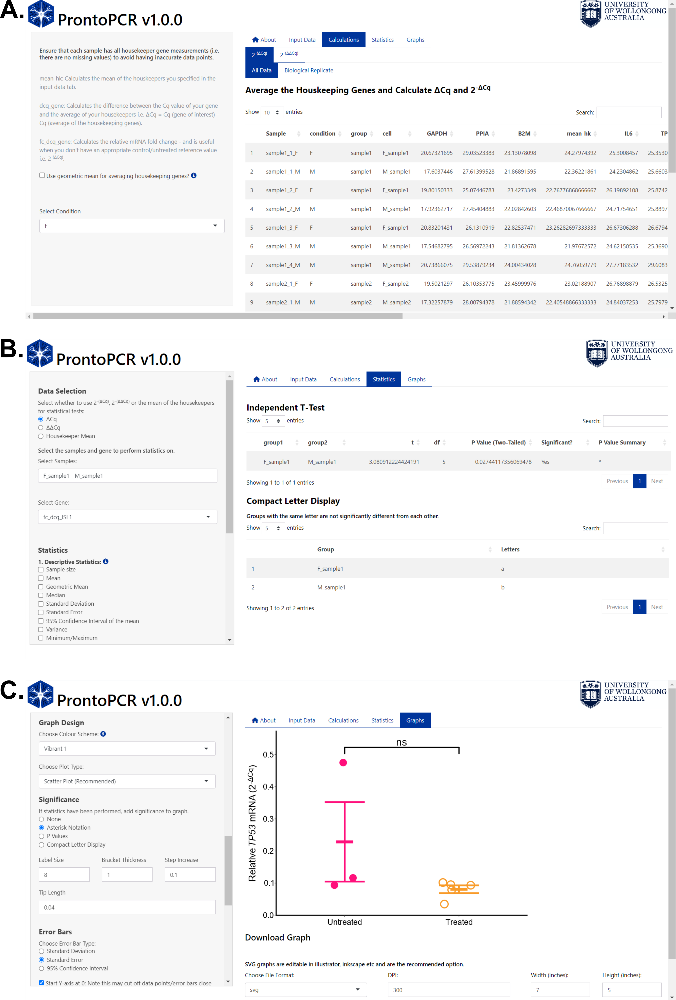

# Summary

Quantitative Polymerase Chain Reaction (qPCR) is an essential technique used to amplify and quantify the amount of DNA, gene or transcript in a sample by measuring the quantification cycle (Cq) threshold. qPCR is widely used in molecular biology, genetics, and diagnostics, and involves a standardised and routine analysis process. Inherently, this means qPCR analysis is repetitive and time-consuming, especially for large data sets. Therefore, an intuitive and versatile software application would be beneficial to automate and fast-track the analysis for a variety of disciplines. \texttt{ProntoPCR} is a software application that serves this purpose, aiming to efficiently and automatically perform routine qPCR calculations, such as averaging the housekeeper genes, calculating ΔCq, ΔΔCq, relative fold-change (2^-ΔCq), and fold-change (2^-ΔΔCq) of the target gene. It also provides the user with options to perform statistics and graphing of the data. 

# Statement of Need

Methods of quantifying relative gene expression through qPCR have remained largely unchanged since its implementation in 2001 [@livak2001analysis]. These calculations rely on raw quantification cycle (Cq) results from a qPCR reaction, which can then be normalised in various manners (Table X). These methods however, are usually performed manually in programs such as Excel. Although this quantification is relatively simple, there are caveats to manual analysis such as being time consuming and prone to human or data entry errors. There is a growing need to automate these tasks, especially for handling large volumes of data. Presenting data in graphical formats is also a laborious task for many samples and targets. Therefore, we developed an application called \texttt{ProntoPCR} to address these issues by seamlessly semi-automating the calculations and analysis of qPCR data. A user can go from raw data to results, including statistics and graphs in just a few clicks. The online application is available here: [ProntoPCR](https://marniemaddock.shinyapps.io/ProntoPCR/). Installation instructions to run the application locally are available on the GitHub page: [ProntoPCR GitHub](https://github.com/MarnieMaddock/ProntoPCR) (give direct link to vignette). A how to use video is available here:

# Overview

\texttt{ProntoPCR} is an open-source, R shiny [@shiny] software application available both online and locally as an R package [@R], making it accessible to users with minimal programming experience. It is also designed to be compatible with the output generated by PCR machines, such as the Quantstudio 5 (Thermo Fisher Scientific) enabling the user to get instant results. Users only require a comma separated values (CSV) file of the raw data, including the quantification cycle (Cq) values, the target (gene) and sample name to get started. The app layout is split into multiple tabs including the About, Input Data, Calculations (Fig. 1A), Statistics (Fig. 1B), and Graphs (Fig. 1C) tabs. An installation and user guide is available here: [ProntoPCR User Guide]( and here: (video)

 Figure 1. Overview of \texttt{ProntoPCR} graphical user interface including A) Calculations, B) Statistics and C) Graphs tabs.

# Requirements and Limitations

The main requirement for \texttt{ProntoPCR} to run is a correctly formatted .csv file, including the Sample names. If the inserted .csv file does not meet the requirements, a variety of error messages can prompt the user to alter the .csv file until it is in the correct format (see user guide). The application also does not include exhaustive options for statistics and graphing, however users can download the results of each calculation, which can be fed into their own analysis pipelines. \texttt{ProntoPCR} has been designed to operate both online and locally. Whilst we aim to maintain online availability, the hosted platform may change or become unavailable. Therefore, it is recommended to rely on the local version, which functions with the same features as the online option. The local version also does not require internet access once installed. To run the application locally, the user needs to download R and RStudio (link). A step-by-step guide on how to install the application locally is available on the GitHub page, as well as this video. The guide is aimed at users with minimal programming expertise, making ProntoPCR accessible to all. 

# Acknowledgements

This project was supported by the University of Wollongong and the Australian Government Research Training Program (AGRTP) scholarship.

# References